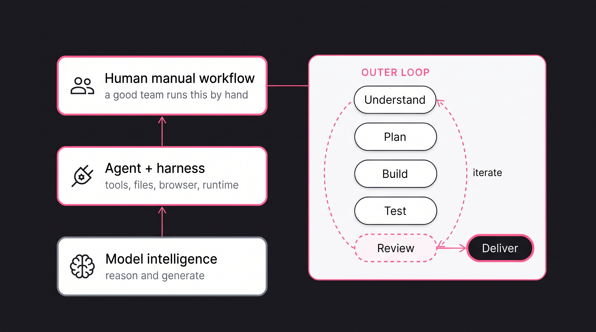
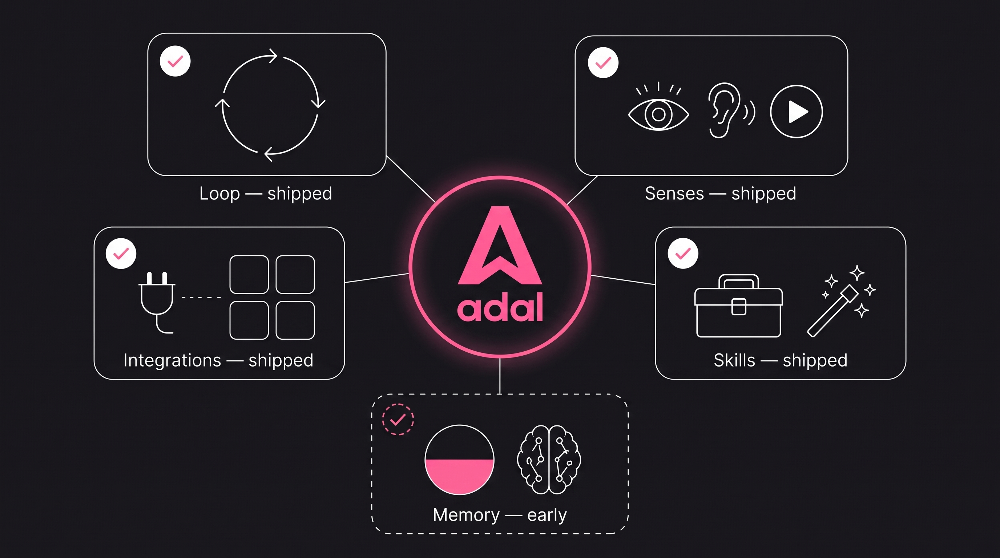
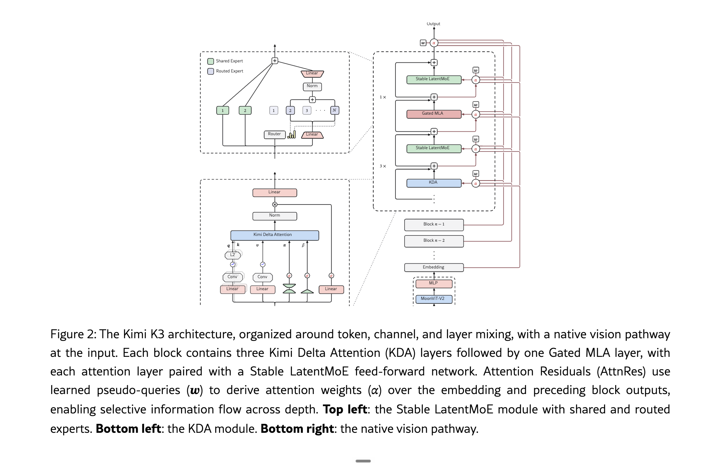
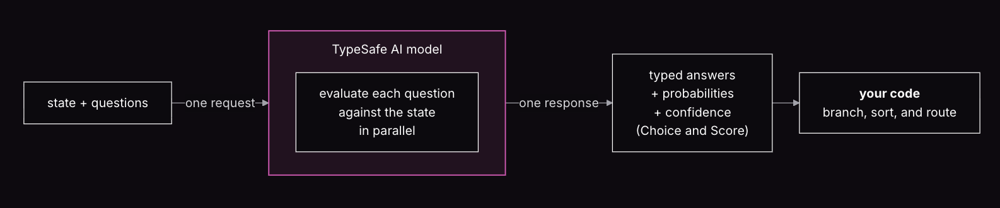
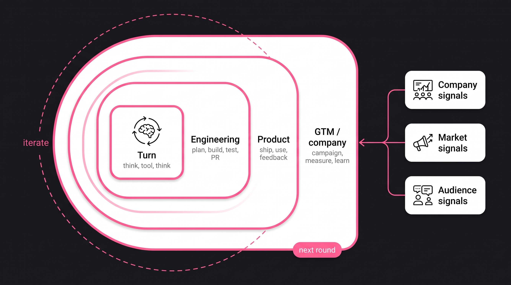

# [@panda_liyin](https://x.com/panda_liyin)


# When the sun goes down, does your work still go on?

Instinct is worth $2.5B to book your dinner reservation or flights. They built the agent harness for simple daily tasks. Jev is another model that works alongside the LLM, made for automation. AdaL's mission is to automate professional work. That work is much dirtier because it needs more context, and people and agents have to collaborate. You can count on her to stay with it. 


## what is adal 

AdaL is your automation-first agent harness. 
Every coding agent can build, but only AdaL does GTM directly from your codebase.

Buildng something is easy, claude code, cursor, codex, opencode, manus, lovable can all for this for developers or non-developers. but having a codebase might not even be the first step, the distribution has become harder than ever. 

But when u combine the strength of a coding agent harness to focus on even higher value tasks; that is Go to the market, that is where things get really interesting. 

AdaL started as a coding agent. Somewhere along the way it also started writing our launch posts, our landing copy, our release notes, straight from the code it had just shipped. That was not a pivot we planned. It is what an agent with enough autonomy does. We foud GTM is the least served categories. Tech-founders are strugged with making their product demos, launching their company and companies. a video can take 20k, a 2 weeks waiting for editing.

every product release, there needs produce updates, posts in their social channel. content creators struggle with content research, workflow to create menaingful realtions, creating the video demos. 


More autonomy is not a developer wish. It is what every kind of work needs, whatever the material is: code, copy, designs, reports. The tools change. 

  If you are a developer, you may have already heard some of the words floating around this idea. **Loop engineering**. **Graph engineering**. **Jev**, a model built to judge. These are the key words, and today I want to show how they combine inside one coding agent.


## The babysitting paradox

Everyone wants more agents, so people can be freed for work that is more interesting and higher value. The company that actually gets agents working on real tasks will be more effective, more productive, and will have a competitive advantage. That is agentmaxxing: you define a clear outcome, hours back, people checking strategy and researching the next steps, while the AIs automate the mundane tasks around them.

On the other side, the agents currently are tied to your employees babysitting them. Tokenmaxxing is easy, as easy as asking developers to use an upgraded VS Code, an advanced autocomplete. They keep working almost the same hours, still on GitHub. More output, true. More productive, not necessarily, because bugs can appear later. Tokenmaxxing is becoming more expensive, yet the quality is not better. The desire is agentmaxxing, yet many end up tokenmaxxing.

Making an agent run continuously is not the hard part. Loops that re-prompt the agent, timers that fire it again, queues that stack up tasks: you can get a session that never stops within an afternoon. The hard part is the question that shows up the moment it runs non-stop: **is the output actually good? is it making destructive operations?**

That is the babysitting paradox. If you let it run, quality drifts, and you find out late, after the mess is big, and you will spend more time cleaning up the mess. If you want quality, you sit and watch every step, and you are back to pressing Enter, or reject. It does not matter what the work is. Code that compiles but breaks a contract. Copy that sounds right and gets the facts wrong. A report that is fluent and wrong.

When the sun goes down, is your company still working toward that advantage, or did the work stop when your people stopped babysitting the agents? Agentmaxxing is the future, but that future, we are just scratching the surface.


## What human quality work actually takes.

  Look at what a good engineer really does when they check work. They run an iterative cycle, like a development lifecycle: build, test, read the failure, change something, build again. The process itself is complicated, and each round demands a different capability. They write integration tests and drive the app with a browser debug tool. Test engineers then click through the product by hand and walk the whole flow. They look at the screen and judge what they see. They listen to the audio and hear what is off. Quality comes from multiple rounds of process, human senses, and judgement.



*Three levels: model intelligence, agent plus harness, human manual workflow. A product engineering team runs a more complicated process.*

  For an agent to reach human-expert level autonomy, five gaps have to close:

  This picture is the **outer loop**: the development lifecycle. What loop and graph engineering automate is that loop: the rounds, the checks, the handoffs. And the graph gives the process a structure where different workers stand in for different people on a team, each starting with fresh context, so the work no longer rots in one ever-growing window.

  **1. Follow the complicated process.** Real work is not one prompt. It is a messy, iterative cycle with rounds of building and checking, and the order matters.

  **2. Have human-level senses.** Read the page like a person reads it. Watch the video. Hear the audio and notice what sounds wrong. Judge the visual result, not the text description of it.

  **3. Expert-level skill for the work.** Knowing what "good" means in this craft: the playwright test that actually catches the bug, the mix that makes audio sound right.

  **4. The context of the project.** This codebase, this product, this audience. The same output can be right in one project and wrong in another.

  **5. The memory of the humans.** What we tried last month, what failed, what we promised the customer. Decisions that live in people's heads, not in any file.


  The same chart works for levels. Today's systems sit low on the autonomy axis. They are built like a tool, not an autonomous agent. They come with heavy supervision and manually configured capabilities.

Today we go a bit deeper on loop and graph engineering, and on Jev: how they help manage the process.

## Where AdaL stands

AdaL has been exploring these fields, and we have seen the power firsthand. The same agent that ships code also tests PRs automatically, builds demos and marketing campaigns from the codebase, and automates social outreach and engagement so the work actually gets distributed.

Today we focus on the process, not those other parts. This session is about how agents follow and coordinate a complicated process: define a clear goal, then achieve it.
   




## Modeling: LLM vs Jev


The first question is what actually drives an agentic workflow. Two kinds of models sit in it today.

The popular one is the large language model. We use it as the planner. We use it to power sub-agents. For every LLM you set a rule. That is how an LLM becomes a stand-in for a human team.



Source: Kimi Team, Kimi K3: Open Frontier Intelligence · [arxiv.org/abs/2607.24653](https://arxiv.org/abs/2607.24653)

*Kimi K3 architecture: an LLM built for generation. Token, channel, and layer mixing, plus a native vision path. This is the planner. It is not the judge.*

Lately Jev is trending for a specific reason. Agents make a huge number of decisions, and today those decisions are still generated token by token. Jev changed that: classification-shaped decisions, about 200 times faster and 400 times cheaper.

The LLM is for the tool calls. That is the planner: think, call, think again. Jev sits next to it, on the classification jobs that happen a lot. Model routing: which model should take this turn, or what "make it cheaper" maps to in the catalog. Call quality: did this response actually do the work, or did it just say it would. A permission check before a destructive command runs. Whether a fact is worth remembering, or just chatter. Whether an old session is the one they asked for.

There is a limit. Hosted Jev takes text only. A lot of those classification jobs, in real work, also need an image, or audio, or video. Independent open-source projects already run Jev-shaped decisions over images and audio. That is the utility we care about: a classifier that can look and listen, not just read.


That is what [Jev](https://docs.typesafe.ai/concepts/system-one) is. From TypeSafe: you send state plus typed questions, you get typed answers with probabilities. Not a paragraph. Not a chat. One call, three independent questions, from [TypeSafe's quick start](https://docs.typesafe.ai/):

**Input:**

```json
{
  "model": "jev-latest",
  "state": "I've tried to connect Stripe for 3 days. It keeps failing, I'm losing sales. Please help ASAP.",
  "questions": {
    "department": {
      "type": "choice",
      "instructions": "Which team should handle this?",
      "criteria": {
        "billing": "Payment or subscription issues",
        "technical": "Bugs or integration problems",
        "sales": "Pricing or account questions"
      }
    },
    "frustration": {
      "type": "score",
      "instructions": "How frustrated does the customer appear?",
      "criteria": [
        "Calm",
        "Frustrated but civil",
        "Very angry"
      ]
    },
    "is_urgent": {
      "type": "noul",
      "instructions": "Does the message convey urgency?"
    }
  }
}
```

**Output:**

```json
{
  "model": "jev-1.13.0",
  "answers": {
    "department": {
      "type": "choice",
      "choice": "technical",
      "confidence": 0.78,
      "probabilities": {
        "technical": 0.85,
        "billing": 0.15,
        "sales": 0.0
      }
    },
    "frustration": {
      "type": "score",
      "score": 1.0,
      "confidence": 1.0,
      "legend": {
        "0": "Calm",
        "1": "Frustrated but civil",
        "2": "Very angry"
      },
      "probabilities": {
        "0": 0.0,
        "1": 1.0,
        "2": 0.0
      }
    },
    "is_urgent": {
      "type": "noul",
      "noul": 1.0
    }
  }
}
```

Three questions, one pass: route to technical, frustration at "civil," urgency at 1.0. Your code then branches, sorts, and routes. No generated paragraph to parse.

[The launch post](https://typesafe.ai/blog/introducing-system-one-models-and-jev) publishes the numbers: 70–500 ms per judgment.

**Why it is fast and small.** Three components, straight from the founder's post. **RLCD training**: the reward is calibrated correctness — an epistemically honest probability — not human preference on prose. A **parallel sampler**: Jev does not generate tokens sequentially; all the typed outputs of a query are emitted in a single pass, which is where the 70–500 ms verdict comes from. And a **constrained output space**: the possible answers and their structure are defined before the query, so a type error is impossible by construction — the model cannot hallucinate a field that does not exist in the schema.



Source: TypeSafe, Introducing System One Models & Jev · [typesafe.ai/blog](https://typesafe.ai/blog/introducing-system-one-models-and-jev)

*TypeSafe model structure: state + questions in one request, each question evaluated against the state in parallel, typed answers with probabilities and confidence out — then your code branches, sorts, and routes.*

The conclusion is that LLMs and zero-shot classification models like Jev will be a strong combination going forward: they power the automation planning layer. That is the foundation for how we think about automating today. Agents need to compose this kind of workflow to handle very complicated tasks. 


## Harness: loop and graph engineering

We know the loop and the graph. In graph theory and in graph neural networks, those objects already have a long history in engineering and AI. Loop engineering and graph engineering borrow that shape for agents.

A graph here is a formal object: nodes of work, edges of dependency, no cycles. Research has long learned over that object. In computer vision, scenes are encoded as graphs with objects as nodes and relations as edges, and graph neural networks pass messages along them so every node absorbs its neighborhood. That mechanism sits behind molecule discovery, recommendation ranking, and fraud detection.

The agent harness is loosely defined. A useful way to say it: the engineering that drives the agent toward a goal. Think of the outer loop of development, the lifecycle loop. The loop in this situation is a feedback control loop: compare the result against the goal, and stop on a termination predicate.

## The loop: work until the goal is achieved

Loop engineering, here, is basic. The agent works. You don't press Enter after every step. It keeps going until the goal is actually achieved.

Jev sits in this loop at three levels. Same cheap classifier, three different moments.

**1. Tool calls: the premature stop.** About 10% of answers are this. The model says "I'll read the file" or "I'll run the tests," and it never made the call. You see done. The tool never ran. Before AdaL hands an answer back to you, Jev asks one question: is there work that was requested and never done? If yes, we bounce it, and the same turn continues. We measured this on ten cases. The ones that quit early scored 0.92 to 0.96. The ones that actually finished, or stopped to ask a fair question, scored 0.02 to 0.13. Ten cases is small. It is a measurement, not a promise. The point is to take that class of premature stop, the ones that reach you, toward zero. This is shipped.

**2. Auto permission: a more secure YOLO.** Every tool call that can destroy something currently waits for you. That is babysitting. The other extreme is YOLO: approve everything, including `rm`. Jev can sit in front of those calls and return allow, ask you, or deny. Cheap enough to run on every gated command, 70 to 500 ms, hundreds of times cheaper than asking a frontier model. That is where security and autonomy actually meet. You stop pressing Enter on every `rm`, and you do not YOLO the machine. We have not shipped this yet.

**3. Goal achieved: a further nudge when the LLM tries to stop.** At the end of every turn, the model is trying to hand control back. Jev asks: is the goal actually achieved? If not, that is another nudge. The work continues. Same shape as the premature stop, one level up: not "did you make the call," but "did we cross the finish line." /goal is the product for this. You write a finish line: all tests pass, or stop after 20 turns. Claude Code has this. We will too. Jev is the cheap check. If the next turn still needs a reason in words, an LLM can write that. Jev does not have to.

<!--  -->

## The graph: big jobs need more than one worker

The second piece is the graph. Think of it for the more complicated tasks. In real life, a hard job needs a whole team, and how people talk to each other is already a graph. Agents work the same way: one agent coordinating other agents, or a tree, which is just a typical hierarchy. Graph engineering is the word for those forms of collaboration, so agents can take on complicated work, and hopefully more autonomously.

I don't really have a Claude Code example you can point at. There is dynamic workflow research, and there is Claude Code Teams, but none of those give people enough. They burn a lot of tokens, and there is not enough transparency. AdaL created `adal --mode engineer`, where you can see each worker and each scope.

We are not at the stage to coordinate hundreds of agents. It is very expensive, and the quality is uncertain. So we started AdaL Engineer with a UI that simulates what a human engineer does when they use multiple agents on a hard task. This is still experimental. Here is a demo. If it works well, this is our path: AdaL Engineer as the coordination node, potentially for other agents too.

AdaL Engineer is unique in this field.

This is also why we go multi-agent: to avoid context rot.


  One agent with a perfect loop still hits a wall. One context window cannot hold a huge task. And an agent checking its own work is grading its own exam.

  So for big jobs, our agent stops being one agent. It becomes a coordinator that hires workers. A builder writes code. A checker runs the tests. A reviewer reads the final diff having never written any of it. If a piece of the job is itself too big, the coordinator hires another coordinator. You get a tree.


  Each worker starts fresh, with only the context it needs. That is the quiet enemy this defeats: context rot. The longer one context runs, the worse its calls get. A fresh worker seeing one clear task outperforms a tired context that has seen everything.

  You can watch this with **adal --agent-mode engineer**. Give it one goal. It plans, hires workers, checks every piece, and hands you the result with the evidence attached: what changed, what passed, what it threw away and why.

> [DEMO VIDEO PLACEHOLDER]

## The world is already a loop

Loop engineering is not only for one feature. The world already runs this way. Product development is a loop. GTM is a loop. A company is loops inside loops. The interesting part is designing those levels so people and agents can run them together.



*The world is many loops. Company, market, and audience signals have to be processed together, round after round.*

One turn is already a loop: think, call a tool, think again, until the answer is real. That is the premature stop and auto permission. The agent keeps calling until the work in that turn actually happened.

One level up is the engineering loop. Plan, implement, code, iterate, until you have a tested PR. That is /goal, and AdaL Engineer when the job is too big for one context. Stop when the tests are green, not when the model feels done.

One level up from that is the product loop. You ship a feature. Users use it. Feedback comes back, or an issue report comes back, and you iterate. The release is not the end. It is the sensor for the next round.

Then there is the marketing loop, GTM. How do we make the next email better. The next use case. The next product demo. The next script. Our Auto GTM work is this shape: company signals, market signals, audience signals, then opportunity, campaign, content, distribution, engagement, pipeline, learning, then the next opportunity. The growth team already runs a small version of it. Research and publish in the morning. Measure signups at night. Keep the move if signups jumped. Drop it if they did not. The agent keeps going until signups move, not until it has posted.

That last loop is how a company actually works, and it is the least automated. A GTM person is drowning in platforms. They do not need another /model. They need their process run: find the posts about the problem and the product, find UGC, find partners, turn a ship into a demo and a post, then look at what converted. We are talking to teams who already have that process and would pay to automate it. Hear the bottleneck first. Then run the loop.

So loop engineering is not just "automate one engineering feature." It is: how do you design levels of loops so a product works, a company works, and the team and the agents collaborate without someone pressing Enter at every level.

That is what we care about, as an automation-first harness. It is complicated. We will help these people automate the work they already do, while we keep experimenting to automate more and more of the loops.

## What this means for you

  Two sentences worth remembering. **Autonomy** is how much of the work the system can carry. **Agency** is who answers for the result. We want more of the first without touching the second. The agent carries the loop. You still decide what ships.

  And this is not only about code. The loop and the graph do not know what the work is. A marketing team could run the same shape: a coordinator, writers, a fact-checker, one quality bar, one stop condition. That is where this goes.

  All of this is running today in AdaL. The judge checks every candidate final answer, so an announcement without a tool call does not reach you as "done." Engineer mode is in the product. /goal — keep working across turns until a check passes — is next. Try one real task. If it says "done" and isn't, tell me. Those reports build the next version.

Try AdaL: scan, or go to [adalagent.ai](https://adalagent.ai).

One real task. One goal. Tell me where it breaks.

— **Li Yin**, creator of AdalFlow, founder of AdaL · [@panda_liyin](https://x.com/panda_liyin)

## References

```
- Jev / System One — what it is and how it differs from an LLM: [docs.typesafe.ai/concepts/system-one](https://docs.typesafe.ai/concepts/system-one)
- Noul — the yes/no primitive, and what its 0–1 value means: [docs.typesafe.ai/primitives/noul](https://docs.typesafe.ai/primitives/noul)
- Claude Code's /goal — the command this article compares against: [code.claude.com/docs/en/goal](https://code.claude.com/docs/en/goal)
- Addy Osmani — Own the Outer Loop (agency, autonomy, and the AI-code stats): [addyosmani.com/blog/own-the-outer-loop](https://addyosmani.com/blog/own-the-outer-loop/)
- Andrej Karpathy — the LLM-as-OS framing: [x.com/karpathy](https://x.com/karpathy/status/1723140519554105733)
- OpenAI — Harness Engineering: [openai.com/index/harness-engineering](https://openai.com/index/harness-engineering/)
- Anthropic — Effective Context Engineering for AI Agents: [anthropic.com/engineering](https://www.anthropic.com/engineering/effective-context-engineering-for-ai-agents)
- Distill — A Gentle Introduction to Graph Neural Networks (the message-passing figure): [distill.pub/2021/gnn-intro](https://distill.pub/2021/gnn-intro/)
- arXiv — Kimi Team, Kimi K3: Open Frontier Intelligence (the LLM architecture in the Modeling section): [arxiv.org/abs/2607.24653](https://arxiv.org/abs/2607.24653)
- arXiv — Kipf & Welling, Semi-Supervised Classification with Graph Convolutional Networks (the GCN paper that started the GNN wave): [arxiv.org/abs/1609.02907](https://arxiv.org/abs/1609.02907)
- arXiv — Llama Guard: LLM-based input-output safeguard (Meta; the public architecture closest to a text-in/classification-out judge): [arxiv.org/abs/2312.06674](https://arxiv.org/abs/2312.06674)
- TypeSafe — Introducing System One Models & Jev (official architecture: RLCD, parallel sampling, constrained outputs, eval numbers): [typesafe.ai/blog/introducing-system-one-models-and-jev](https://typesafe.ai/blog/introducing-system-one-models-and-jev)
- Hacker News — thread on Jev architecture prior art (contested): [news.ycombinator.com/item?id=49765349](https://news.ycombinator.com/item?id=49765349)
- arXiv — SalesRLAgent (the contested March 2025 preprint): [arxiv.org/abs/2503.23303](https://arxiv.org/abs/2503.23303)
- arXiv — Calibrated Language Models and How to Find Them (instruction tuning degrades calibration): [arxiv.org/html/2508.00264v1](https://arxiv.org/html/2508.00264v1)
- Adnan Masood — Jev and the Return of the Classifier (independent technical review): [medium.com/@adnanmasood](https://medium.com/@adnanmasood/jev-and-the-return-of-the-classifier-490ce05e5d3d)
- TechCrunch — Instinct's AI assistant and its privacy and security concerns: [techcrunch.com](https://techcrunch.com/2026/08/24/instincts-powerful-ai-assistant-is-raising-privacy-and-security-concerns/)
- The Information — Instinct in talks at a $10B valuation: [theinformation.com](https://www.theinformation.com/articles/ai-agent-startup-instinct-in-talks-10-billion-valuation) (paywall)
- WSJ — The latest viral AI assistant rocketing across Silicon Valley: [wsj.com](https://www.wsj.com/tech/ai/the-latest-viral-ai-assistant-rocketing-across-silicon-valley-abb46276) (paywall)
```


  The context gap is **plugins and integrations**. AdaL connects to the places your work already lives: email, LinkedIn, PostHog, Google Drive, Obsidian. The project stops being a folder of code and starts being everything the work touches.

  The memory gap, honestly: we have an experimental adapting memory. It is early, and this article is long already, so we will say more when it has earned its own post.

  All five stand on the same foundation: a judge you can trust. Let me show it. 


  For the process gap, the simple end is **/goal** in our normal dev mode: one agent, plus a judge, plus a loop. You write a finish line. The agent works turn after turn, the judge checks the finish line after every turn, and the session keeps going until the checks pass. High quality and continuous, because quality is enforced at every turn, not at the end by you. Use it for tasks one agent can hold.

  The complicated end is **adal --mode engineer**: the same goal, carried by a graph of workers — multi-tasking, long-running jobs that no single context should hold. The two fit the same process at different sizes, and both close the first gap: the complicated iterative process runs itself, with the judge inside every round.

  The senses gap is why AdaL is an agent of **multiple modalities**: text, images, audio, video. It does not judge a video by reading a description of it. It looks at the frames. It hears the audio. Then the judge can check what the senses gathered.

  The skill gap is closed by **capabilities and skills that load themselves**. AdaL auto-loads the capability a task needs — browser use, writing like a human, and more. It discovers skills on the fly for whatever the senses meet: email workflows, LinkedIn workflows, X workflows. Skills you use often get saved and adapted — to you, your team, your project. That is how a general agent gets expert-level capability on your specific kind of task, and why the tenth run is faster than the first.


  One contested footnote: a Hacker News thread claims prior art in a March 2025 preprint (SalesRLAgent, a probability estimator measuring 85 ms vs 3450 ms for GPT-4); other commenters dispute the similarity, and TypeSafe has not published enough implementation detail to settle it.


## The ten-billion-dollar utopia, and what it skips

  While I was writing this, a startup called [Instinct](https://techcrunch.com/2026/08/24/instincts-powerful-ai-assistant-is-raising-privacy-and-security-concerns/) raised a $250 million Series B at a$2.5 billion valuation — its total funding is $350 million — and is reportedly in talks at$10 billion, per [The Information](https://www.theinformation.com/articles/ai-agent-startup-instinct-in-talks-10-billion-valuation) and [WSJ](https://www.wsj.com/tech/ai/the-latest-viral-ai-assistant-rocketing-across-silicon-valley-abb46276). You text it, and it does the thing: books the table, finds the cheap flight, cleans the inbox, handles the rebooking. Text in, outcome out. No app, no dashboard. The demos feel like magic, and I get why. That is the utopia we were all promised: you say what you want, and it is done.

  But look at what the magic is doing, and the utopia has homework. Two questions decide whether this is the future or a demo.

  First: did they solve memory? Sustained autonomy runs on memory that stays truthful — what you tried, what failed, what you promised, what changed. Instinct's early users found the opposite: emails indexed and kept after disconnecting access, summaries arriving from an inbox that was supposed to be detached. Memory is the hardest problem in this field, and it is where the trust broke first.

  Second: can it do complicated, high-stakes work that is specific to your context and stretches over weeks? Coding is the honest test. It is long-term, iterative, judged by tests and humans, and every decision carries the weight of everything decided before it. Booking a table is one shot and a confirmation email. A migration is a hundred judgment calls that have to agree with each other. Nobody has demonstrated the second kind at this level of autonomy, and the gap between the two is the whole engineering problem this article is about.

  And there is a third cost the demos skip: one unauthorized action resets trust to zero. An early user put it exactly right — every successful action earns a little trust, and one wrong email sent on your behalf spends all of it. A tester phished Instinct with a two-line email. That is the difference between checking a result before it ships and hoping it was fine after.

  This is why I think the credible path is the boring one. Not "text it and magic happens", but a system that runs the loop, checks its work against reality at every round, shows you the evidence, and earns autonomy in verified steps. That is what we built. The judge is shipped, the loop is shipped, the graph is shipped. The utopia is real, and it will be earned in exactly that order — evidence first, magic second.


